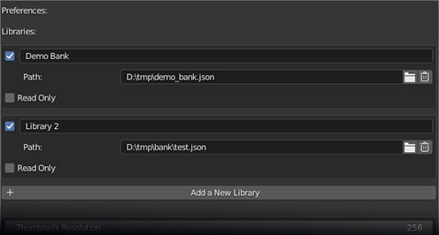

# Asset Bank Addon

## Description
Simple and fast asset banks manager with some extensibility via a small plugin interface.

The initial goal of the addon was the ability to quickly bank assets with as few clicks as possible, no waiting time and
while not imposing a folder structure of stored assets. In order to do this the addon uses collections as sources and only store their paths in json files(the .blend and the collection name) -> no export step.

Example: You bank a collection named Suzanne from toto.blend, when you import Suzanne, it will be imported from toto.blend. 

Although good for creative and organic workflows, you might want to introduce some rules in a production environment. 
The plugin system allows you to customize the banking stage. You could add an ui prompt to fill in an asset name with tags and 
use that information to fill in an asset tracker. You could also store your assets to a more pipeline friendly folder structure.
An example plugin is provided which adds a prompt for name and tags and store the assets in their own files.

## Usage
Once you have enabled the addon it is time to setup it.

1. Open its preferences (you can also click the gear icon in the panel's header).
2. Add any number libraries.
   - Click the "Add New Library" button and fill in the path to a json file eg: D:/workspace/bank.json (.json will be added if omitted). 
     If the json file does not exists it will be created.
   - Optionally you can give it a name which can be used as a way to search assets. Could be one per users if working with other people.
   - Optionally tick the "Read Only" checkbox if you don't want to be able to bank into this one.
     

In order to bank an asset you must be in a saved blend file. If you are starting from a new scene, save it wherever you like but don't delete it, otherwise you'll lose your asset.
1. Make sure that the objects you want to bank are in a collection.
2. Name your collection with an appropriate name.
3. Drag n drop the collection from the outliner in the big box under "Bank To" or alternatively click the box and pick your collection. It will take a screenshot of the viewport and add an entry.
   - (Optionnal) If you have multiple library select for which library the asset will be added prior to this.

Finally, you are presented with the list of asset you have stored. 
1. Click on the append or link button to add an asset to the scene.

### Additionnal notes.
- Removing an asset simply remove its entry in the json file. 
- You can search assets by name, library or filename or any combination of those.
- The list is good for handling thousands of entries but is not ideal for browsing. In this case you can activate the viewport overlay which is link to the list view.
Use the mouse wheel to cycle assets. Single click select the asset in the list view. Double-click instances the asset.

## Knowned issues
- The viewport browser is not automatically refresh on adding/removing libraries in the preferences, and neither when banking. The 'Display Library Overlay' button must be retoggled manually.

## Limitations

- Only collections can be banked.
- Tags for filtering assets are supported but cannot be setted when using the default behavior. 
  The example plugin allows you to add tags at banking, or you are free to make your own plugin.
  
- Screenshots could be better.

## History
[Change Log](./CHANGELOG.md)